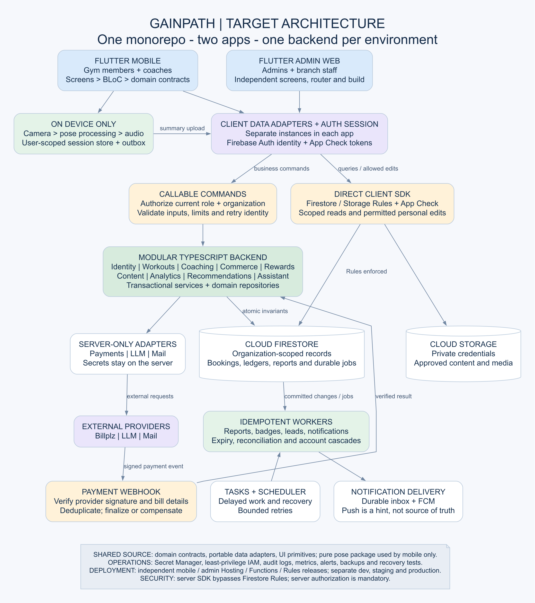

# GainPath target architecture
Date: 2026-09-17
Status (updated 2026-09-19): The two-application structural migration is implemented. The root is now a Dart workspace, not a compatibility app. Role screens and runners reside in their owning apps; shared packages, scoped repositories, durable native workout storage, backend foundations and automated boundaries are verified. Real FlutterFire, payment, camera/ML and most server business workflows remain future integrations. See [implementation report](2026-09-19-architecture-implementation.md) for the actual code boundary, test/build evidence and remaining work. Runtime services in this target blueprint are not all implemented.

## 1. Decision and scope

One Git repository contains two independently buildable Flutter applications:

- Mobile: gym members and fitness coaches; Android first.

- Admin web: administrators and authorized branch staff.

- Shared Dart/Flutter packages: domain contracts, portable data adapters, design system, and pure pose-processing logic.

- One modular TypeScript backend on Cloud Functions for Firebase, organized by business capability rather than microservices.

- Firebase Auth, Firestore, Storage, Hosting, and FCM; Cloud Tasks and Cloud Scheduler for background work.

Working scope assumption: one gym organization with multiple branches initially. Organization-scoped membership and records allow additional organizations later, but tenant onboarding, separate tenant billing, and a platform-superadmin product are not part of this design. If independent gyms are required at launch, tenant isolation and cross-tenant negative tests become first-release gates.

Separate Firebase projects isolate development, staging, and production. The mobile and web app registrations share their environment's backend, not each other's runtime state.

Existing mock behavior is replaceable. Preserve useful UI and domain terminology, but revise code and thesis diagrams when a better operation boundary is needed.

## 2. System overview

The overview is a runtime diagram. Shared source packages are described separately below: importing the same package does not share an in-memory repository or BLoC across devices.

~~~mermaid
flowchart TB
    Members["Gym members and coaches"] --> Mobile["Flutter mobile app"]
    Staff["Admins and branch staff"] --> Web["Flutter admin web app"]
    Hosting["Firebase Hosting"] --> Web
    Mobile --> Local["On-device pose engine, audio and durable session store"]

    Mobile --> Auth["Firebase Auth"]
    Web --> Auth
    Mobile --> ClientData["Client repository implementations - separate instances per app"]
    Web --> ClientData
    Local -->|"Summary upload through mobile repository"| ClientData

    ClientData -->|"ID token and App Check token"| Commands["Callable functions: authorize, validate, execute"]
    ClientData -->|"Authorized queries and allowlisted personal edits"| Rules["Firestore / Storage Rules and App Check"]
    Rules --> Database[("Firestore")]
    Rules --> Storage[("Cloud Storage")]

    Commands --> Services["Domain services and transactional repositories"]
    Services --> Database
    Services --> Adapters["Server-only payment, LLM and mail adapters"]
    Adapters --> External["Billplz, LLM provider, transactional mail"]
    External -->|"Payment webhook"| Webhook["HTTPS webhook: verify signature and event identity"]
    Webhook --> Services

    Database -->|"Committed changes / durable jobs"| Workers["Idempotent background workers"]
    Scheduler["Cloud Scheduler and Cloud Tasks"] --> Workers
    Workers --> Services
    Workers --> Push["FCM and notification inbox"]
    Push --> Mobile
    Push --> Web
    Secrets["Secret Manager and least-privilege IAM"] -.-> Adapters
    Observability["Logging, audit records, metrics and alerts"] -.-> Services
    Observability -.-> Workers
~~~

Rules protect direct client SDK requests. Server SDK requests use IAM and bypass Firestore Rules, so every backend operation must independently authorize the caller and validate its inputs. The payment webhook uses provider-signature verification; it is not an ordinary App-Check-protected client callable.

FCM is a delivery hint. Realtime subscriptions and durable notification records provide recoverable state when a push is missed.

## 3. Repository and package layout

~~~text
gainpath/
  pubspec.yaml                         # Dart workspace membership
  pubspec.lock                         # Committed application dependency resolution
  apps/
    mobile/
      pubspec.yaml
      android/
      ios/                             # Introduced when iOS is supported
      lib/
        main.dart
        app/                           # Bootstrap, router, DI, session scope
        features/                      # Member and coach workflows
          <feature>/
            application/              # BLoC/Cubit and workflow coordination
            presentation/             # Screens and feature widgets
        infrastructure/
          pose/                        # Camera/model adapters and lifecycle
          audio/                       # TTS and bundled cue playback
          local/                       # Durable store and session outbox
          sync/                        # Account-scoped synchronization worker
      test/
      integration_test/
    admin_web/
      pubspec.yaml
      web/
      lib/
        main.dart
        app/                           # Independent router, DI and staff scope
        features/
          <feature>/
            application/
            presentation/
      test/
      integration_test/
  packages/
    gainpath_domain/                   # Pure Dart, organized by domain
      lib/src/<domain>/
        entities/
        value_objects/
        policies/
        repositories/                 # Async contracts
    gainpath_data/
      lib/src/<domain>/
        dto/
        mappers/
        repositories/
        sources/                      # Firebase SDK and callable clients
      lib/src/fakes/                   # Isolated contract-compatible fakes
    gainpath_ui/
      lib/src/tokens/
      lib/src/components/              # Truly shared visual primitives
    gainpath_pose/
      lib/src/frames/                  # Timestamped canonical landmarks
      lib/src/filtering/
      lib/src/kinematics/
      lib/src/tracking/
      lib/src/repetition/
      lib/src/scoring/
      lib/src/games/
      lib/src/feedback/                # Cue decisions, not audio plugin calls
  functions/
    package.json
    src/
      index.ts                         # Thin deployment exports
      modules/
        identity/
        workouts/
        coaching/
        commerce/
        rewards/
        content/
        analytics/
        recommendations/
        assistant/
        notifications/
        # Each module contains only the handlers/services/repositories it needs.
      platform/
        authorization/
        validation/
        idempotency/
        firestore/
        adapters/                      # Billplz, LLM, mail
        jobs/
        observability/
    test/
  firebase/
    firestore.rules
    firestore.indexes.json
    storage.rules
    tests/
  firebase.json
  contracts/                           # Versioned request/response schemas and fixtures
  docs/
    architecture/
  tool/                                # Boundary checks and local development scripts
  .github/workflows/                   # Package-aware checks and deployments
~~~

This is the target layout, not an instruction to scaffold every empty folder. Keep feature-specific domain additions local until they become shared; avoid a generic dumping-ground core package.

Mobile and admin never import each other. Their screens and navigation remain separate. Member and coach experiences remain inside the mobile application.

~~~mermaid
flowchart LR
    M["apps/mobile"] --> D["gainpath_domain"]
    W["apps/admin_web"] --> D
    M --> A["gainpath_data"]
    W --> A
    A --> D
    M --> U["gainpath_ui"]
    W --> U
    M --> P["gainpath_pose - pure Dart"]
    M --> N["Mobile-only camera, ML, audio and local-storage adapters"]
    N --> P
    B["functions - TypeScript"] -.-> C["Versioned API schemas and shared test fixtures"]
    A -.-> C
~~~

Solid arrows are source dependencies. Dashed arrows represent contract compatibility, not importing Dart classes into TypeScript.

Rules:

1. Domain and pose packages import neither Flutter nor Firebase.

2. UI primitives do not import data repositories or business workflows.

3. BLoCs depend on domain contracts, not Firebase implementation classes.

4. Only composition roots choose concrete data implementations.

5. Application features do not import another feature's screens; app routing composes navigation and passes IDs.

6. Data repositories do not obtain dependencies through other repositories' static seed objects. Inject sources and coordinate multi-repository operations in application/domain services.

7. Mock repositories own their instances and emit the same streams and failures as real contracts.

8. Shared-package tests and every consuming app are checked when shared code changes.

## 4. Client layers, contracts and session lifecycle

Views dispatch intent to a BLoC/Cubit. The BLoC calls a repository or a use case when several operations must be coordinated. It observes repository streams and emits immutable state.

Do not create a use-case wrapper for every trivial getter. Add one when it owns a meaningful policy or workflow.

Representative contracts:
~~~dart
abstract interface class BookingRepository {
  Stream<List<Booking>> watchMemberBookings(BookingQuery query);
  Stream<List<Booking>> watchCoachSchedule(ScheduleQuery query);
  Future<BookingHold> createHold(CreateBookingRequest request);
  Future<void> cancelBooking(CancelBookingRequest request);
  Future<void> rescheduleBooking(RescheduleBookingRequest request);
}
~~~

Other contracts include AuthRepository, ProfileRepository, WorkoutRepository, AvailabilityRepository, MembershipRepository, PaymentRepository, RewardRepository, ContentRepository, AnalyticsRepository and AssistantRepository. Interfaces use typed DTO-independent domain values, not mutable lists or Firestore snapshots.

- Commands return a typed result or throw a documented typed failure. Use one convention consistently.

- Failures distinguish validation, unauthenticated, forbidden, conflict, offline, transient dependency failure and unexpected error.

- Queries carry IDs, date ranges and pagination cursors. Admin reports return typed aggregates.

- Commands that can be retried carry an idempotency key. IDs are stable UUIDs or server-generated IDs, never short timestamp fragments.

- Money uses integer minor units and currency. Database timestamps use UTC; scheduling and attendance explicitly use the organization's IANA timezone.

- Wire enums use stable machine values. UI labels and translations are separate.

- Forms can validate locally; the server validates again before authoritative writes.

Root scope holds environment configuration, AuthRepository and routing. A signed-in scope keyed by user ID and organization contains user repositories and feature BLoCs. A workout or chat has a narrower session scope.

Logout or organization change cancels subscriptions and in-flight work, disposes user BLoCs, and clears in-memory personal state. Local pending workout records remain isolated under their original user/organization identity and cannot upload under the next login. Shared-browser persistence of personal data is disabled by default.

Authentication transitions include signed out, checking session, email verification required, profile setup required, active, suspended and deactivated. Role selection never grants permissions. Mobile role navigation and admin route guards derive from verified identity and current organization membership.

## 5. Data ownership and access paths

Use global users/{uid} for minimal personal identity and orgs/{orgId}/members/{uid} for organization membership, effective role, branch access and status. Scoped role claims may assist access checks; sensitive operations also check current membership to avoid relying on stale claims.

| Data or operation | Authoritative writer | Client access |
|---|---|---|
| Auth identity and credentials | Firebase Auth / trusted provisioning | Auth SDK; no passwords in Firestore |
| Display profile, personal goals, saved advice | Owner, restricted by field-level Rules | Direct SDK allowed for explicitly permitted fields |
| Roles, verification, suspension, account lifecycle | Identity commands | Authorized staff commands; scoped reads |
| Published tutorials, equipment, routines, announcements, settings | Authorized content commands | Versioned published reads; staff editing commands |
| Coach availability and booking slot allocation | Coaching commands | Scoped reads and commands |
| Workout and mini-game accepted summaries | Session submission command | Local creation; idempotent upload; scoped history reads |
| Transactions, subscriptions, refunds, commission | Verified payment handlers and commerce/coaching services | Client reads status and requests allowed actions |
| Reward ledger, balance, badges, vouchers | Reward commands/workers | Client reads; claim/redeem through commands |
| Analytics and recommendation projections | Workers or authorized aggregate queries | Scoped read-only results |
| Chat messages and contextual AI replies | Assistant commands | Conversation-owner access |
| Private uploaded media | Owner/staff under Storage Rules and validation | Scoped upload/download; no public certification URLs |
| Audit events, processed-event markers and job state | Backend only | Restricted operational access |

Each organization owns branches, profiles, bookings, slot locks, workoutSessions, miniGameSessions, memberships, transactions, refundRequests, rewardAccounts, rewardLedger, vouchers, content, analytics, recommendationLeads, conversations, notifications, auditEvents and internal jobs. These are ownership groups, not a requirement for a single flat collection per group.

Use IDs for relationships; names are display snapshots. Keep private coach credentials separate from the published coach directory. Publish a coach only after the required credential set is verified.

Separate source records from derived reporting documents. Queries must carry organization, branch and relationship constraints compatible with Rules. Filter locally within a bounded loaded result; use pagination/server queries for larger datasets. Cross-organization collection-group access is not allowed implicitly.

Public client configuration contains no privileged credentials. Payment, mail, LLM and service-account secrets remain server-side.

## 6. Backend module coverage

| Module | Mobile / admin consumers | Backend responsibility |
|---|---|---|
| Identity | M1, M8, M11 | Profiles, coach invitations and verification, permissions, suspension and deletion |
| Workouts | M2, M5 | Validate and accept session summaries, history, consent references |
| Coaching | M7, M9, M10 | Availability, atomic slot holds, bookings, inquiry/reply notes, completion and one review per session |
| Commerce | M4, M7, M9, M11 | Checkout intents, webhook reconciliation, membership, refund jobs and commission ledger |
| Rewards | M3, M11 | Attendance, points, badges, stock, voucher issuance and redemption |
| Content | M2, M6, M11 | Exercises, routines, equipment, announcements, versioned disclaimers and settings |
| Analytics | M5, M9, M12 | Member progress, coach performance, branch/platform aggregate views |
| Recommendations | M13 | Deterministic scoring, lead generation, staff approval and dispatch |
| Assistant | M6 | Authorized context retrieval, LLM adapter, persisted responses and usage limits |
| Notifications | Cross-module | Durable inbox, push/mail jobs, preferences and retry tracking |

Modules are organizational boundaries inside one backend codebase, not separately networked microservices. Functions remain thin: parse and authorize, invoke service, map result. Services use transactional repository operations and server adapters.

Immediate invariants stay together in a command transaction:

- Reserving or releasing slot locks with the associated booking state.

- Confirming verified payment with the purchased entitlement when it fits the transaction.

- Deducting reward points and reserving stock while creating a voucher.

- Marking a voucher redeemed once.

- Writing a durable job record with any state change that requires later external work.

Event-driven work handles effects that tolerate delay: notifications, badges, reports, recommendation evaluation, large account cascades and reconciliation. A notification failure must not undo a valid booking.

Every worker checks the relevant transition/version and applies a processed-event marker and its database effect atomically. A marker alone is insufficient if it is committed separately from the effect. External API calls happen outside Firestore transaction callbacks, with durable operation state, provider idempotency where supported, and reconciliation when the result is uncertain.

Cloud Tasks handles delayed/retried work with bounded retries; Scheduler periodically reconciles due work and missed scheduling. Booking holds are rejected immediately when expiresAt has passed even if a cleanup task is late. Firestore TTL is housekeeping, not the authority for slot availability.

Do not preserve the old diagram's fixed count of 15 reactive functions. Preserve responsibilities while consolidating atomic invariants and avoiding trigger chains.

## 7. Booking and payment sequence

~~~mermaid
sequenceDiagram
    actor Member
    participant App as Mobile app
    participant API as Coaching and commerce commands
    participant DB as Firestore
    participant Pay as Billplz
    participant Hook as Verified webhook handler
    Member->>App: Choose coach and time
    App->>API: createHold(requestId, coachId, start, duration)
    API->>DB: Transaction: validate eligibility, availability, cap; reserve slots; create pending booking
    DB-->>API: Hold and checkout intent
    API->>Pay: Create bill outside database transaction
    Pay-->>API: Bill ID and checkout URL
    API->>DB: Persist bill mapping and operation status
    API-->>App: Hosted checkout URL and booking ID
    App->>Pay: Open hosted checkout
    Pay-->>Hook: Signed server payment event
    Hook->>Hook: Verify signature, bill mapping, amount and currency
    Hook->>DB: Transaction: deduplicate payment and finalize valid hold
    DB-->>App: Authorized subscription reports confirmed or failed state
    App-->>Member: Display authoritative outcome
~~~

Required edge cases:

- Allocate every occupied slot unit, not only the start time, so overlapping durations conflict. A hold's daily-cap accounting also updates in the same transaction.

- Repeated create requests return the original operation. A bill-creation timeout remains pending reconciliation rather than blindly creating another bill.

- Webhooks arriving before mapping completion are durably retained/retried; they are not silently discarded.

- Failed or expired holds release their locks through an authorized transaction. A late successful payment must never confirm a slot that has been reassigned: record the settled payment and start compensation/refund or staff review.

- Client redirects/callbacks are UI hints, not proof of settlement. Never accept client-supplied prices as authoritative.

- Cancellation enforces the defined deadline and releases locks atomically. Refund eligibility is a separate policy.

- Rescheduling acquires new slots and releases old slots atomically; failure preserves the original booking.

- Completing a session requires the assigned coach and valid notes. A member can review that completed session once.

- Refund approval creates durable refund work. Mark a payment refunded only after provider-confirmed success, including reconciliation for uncertain outcomes.

- Baseline policy for review: cancellation at least 12 hours before start; rescheduling at least 24 hours; refunds within 168 elapsed hours, with future timestamps rejected. Store policy version and applicable pricing on the operation.

- A recurring membership does not imply automated charging. Automatic collection requires a confirmed provider mandate/token capability; otherwise implement renewal reminders and explicit checkout.

## 8. On-device pose and offline session architecture

~~~mermaid
flowchart LR
    Camera["Camera permission and consent"] --> Adapter["Mobile detector adapter"]
    Adapter --> Frames["Timestamped canonical PoseFrame"]
    Frames --> Filter["Filtering and normalization"]
    Filter --> Health["Tracking health and missing-joint checks"]
    Health --> Geometry["Joint geometry and exercise rule set"]
    Geometry --> Reps["Repetition FSM"]
    Geometry --> Score["Form deviations and score"]
    Health --> Game["Mini-game pose matching"]
    Reps --> Session["Session coordinator"]
    Score --> Session
    Game --> Session
    Session --> Feedback["Cue priority and cooldown"]
    Feedback --> Audio["Mobile audio adapter"]
    Session --> View["BLoC summary state and lightweight overlay stream"]
    Session --> Local[("User-scoped local session store and outbox")]
    Local --> Sync["Authenticated retry worker"]
    Sync --> Server["submitWorkoutSession or submitMiniGameSession"]
~~~

The pose package performs pure processing. Native model invocation, image conversion, camera lifecycle and audio plugin calls belong in mobile adapters. Use isolates for appropriate Dart computation; native SDK inference follows that SDK's threading requirements.

Initial detector candidate: ML Kit's 33-landmark pose API behind a PoseDetector port. Validate its integration and performance on target Android devices before locking the dependency. A custom TFLite adapter is an extension point, not a mandatory second implementation at first release. Do not claim that different detectors provide interchangeable confidence, coordinate or depth semantics.

PoseFrame includes monotonic capture time, detector identity/version, landmark identifiers, visibility/confidence capabilities, coordinate convention, and orientation/mirroring metadata. Mark absent landmarks explicitly. No raw frames or landmark streams are uploaded.

Tracking quality is distinct from form accuracy. Scoring uses exercise-specific geometric rules and valid tracked intervals. Persist the scoring/rule version and rejected/tracked duration alongside final metrics. Device placement, body orientation and supported exercise limitations must be part of calibration.

Use a bounded latest-frame pipeline; discard stale frames instead of queueing unlimited inference work. Separate elapsed wall time, inference cadence and UI rendering. Do not dispatch a once-per-second demo tick for each real camera frame. The overlay can consume a lightweight landmark stream while BLoC emits summarized session state.

Use timestamp-based tracking-loss windows calibrated for the selected detector, rather than assuming five frames equals five seconds. Phone IMU can detect camera movement; it does not corroborate the athlete's movement when the camera phone is stationary.

Persist session checkpoints locally before showing a saved result. A durable outbox contains stable session ID, user/organization ID, bounded summary, policy/model version, attempt count and acknowledgement state. On reconnect, upload only under the original identity. The server accepts each session once; duplicate transport attempts return the same acceptance.

History distinguishes saved locally, awaiting upload, accepted, and needs attention. Keep rejected summaries available for recovery. Ordinary Firestore offline caching does not replace a defined durable workout recording and submission lifecycle.

Offline-supported: an already authorized, consented workout with locally available rules/content, pose/audio processing and local summary recording. Online-required: booking confirmation, payment, reward claim/redemption, AI chatbot response and privileged admin commands.

Accepted device summaries remain client assertions. Schema checks, plausible limits, ownership and duplicate protection help reward integrity but cannot prove physical exercise occurred. Avoid describing on-device inference or App Check as proof of exercise authenticity.

## 9. Rewards, analytics, assistant and operational workflows

Attendance: one server transaction per user, organization and local calendar date. Store last qualifying date, timezone policy and streak behavior. Define attendance streak separately from workout consistency if both are displayed. The date is server-derived; changing the device clock cannot grant another claim.

Rewards: a ledger entry identifies its source event/session and policy version. Apply ledger creation and balance change together. Voucher issuance checks available balance, stock and eligibility atomically; redemption checks branch/staff authority, expiry and unused state in one transaction. Large/valuable rewards may require additional fraud controls.

Analytics: keep immutable source records and bounded typed projections with updatedAt and calculation version. Use server aggregation or precomputed views for admin and coach reports, not downloading the complete transaction ledger. Rebuild projections when rules change. FCM is not the synchronization mechanism.

Recommendations: begin with transparent rule-based scoring from accepted session summaries and exercise/rule versions. Record the evidence and reason for each lead, deduplicate repeat leads, and require authorized approval before dispatch where the workflow specifies it.

Assistant: route requests through a backend adapter. Retrieve only authorized, bounded user/profile/workout context. Store conversation ownership, request ID, model/prompt version and status. Apply usage limits and timeouts. Treat model output as untrusted content; no automatic booking, payment or administrative action follows from model text. Display educational scope and allow safe failure/retry. API keys never ship to either Flutter app.

Uploads: validate MIME/content, size, ownership and allowed paths. Private certifications remain private; publish only approved metadata. Record consent version/time and a server acknowledgement; locally retained consent permits a previously authorized offline workout.

Account suspension: deny new privileged operations immediately using authoritative membership status, then process affected bookings and notifications with resumable jobs. Account deletion separates personal-data erasure from specifically justified financial/audit retention and clears associated Storage objects and subcollections. Document the retention policy rather than assuming deletion of a parent removes all related data.

## 10. Deployment, compatibility and verification

- Dart Pub workspace; each app has its own pubspec and entry point. Keep mobile-only plugins out of the admin app's entire transitive package dependency graph, not merely out of its Dart imports. Workspace resolution can include packages that are not dependencies of both apps.

- Independently deploy mobile builds, web Hosting, Functions and Rules. Keep API/schema changes backward-compatible because installed mobile versions will lag behind backend deployments.

- Use versioned DTOs, additive schema migrations and emulator fixtures. Dart and TypeScript share contract fixtures/schema definitions, not business implementation binaries.

- Default local development to fakes or Firebase emulators. Production startup must reject mock backends and debug App Check configuration.

- Build settings explicitly select environment; avoid letting an arbitrary runtime toggle select production credentials.

- CI: formatting and analysis; package/layer import checks; contract, policy and BLoC tests; emulator Rules/function tests; Android and web builds; key end-to-end flows. Use tool exit codes, not grep-only success checks.

- Add negative authorization, cross-user/organization reads, stale roles, duplicate/reordered webhooks, concurrent holds, double redemption, expiry boundaries, logout during requests, offline restart and sync retry tests.

- Benchmark pose capture-to-feedback latency, dropped frames, rep-count error, false corrections, battery/thermal behavior and supported device/camera conditions. Agree numeric acceptance targets before declaring NFR completion.

- Correlate command ID, booking ID, payment ID, session ID and job ID in logs. Audit privileged decisions without logging passwords, tokens, payment details or raw biometric data.

- Alert on unreconciled settled payments, stuck refunds, repeated failed jobs and authorization anomalies. Back up critical data and test a recovery procedure.

## 11. Implementation order and completion gates

1. Approve detailed boundaries and confirm organization scope; reconcile the thesis model/sequence choices.

2. Separate mobile/admin packages while preserving working UI; extract only proven shared code. Both applications must build independently.

3. Introduce immutable domain contracts and isolated fakes, then implement Firebase identity and user-scoped lifecycle with negative authorization tests.

4. Validate one real pose detector/exercise early, alongside the identity work. Deliver workout -> local save -> accepted upload -> history as a complete flow.

5. Implement availability/booking transactions and sandbox checkout/webhooks/refunds, including duplicate and race tests.

6. Add server reward ledger/vouchers, content management, projections/recommendations and assistant integration in domain-sized increments.

7. Verify the requirement-to-code matrix, device results, recovery behavior, API compatibility and deployment runbooks.

Current checkout status after the 2026-09-18 implementation slices: boundaries and
independent app hosts are complete; shared identity, Firebase-auth validation boundaries,
pose processing, booking-hold/payment-webhook scaffolds, and the mobile workout vertical
slice are partial; mobile workout summaries now have durable local storage, pending/accepted
outbox state, retry behavior and history loading. The default upload adapter still fails
closed until an authenticated Firebase/Functions endpoint is connected. Rewards, content,
analytics, assistant production flows and deployment gates remain outstanding.

The old 15-reactive-function count, confidence-as-accuracy demo, synchronous list repositories and client-cleared payments are not constraints on the implementation.

## 12. Primary technical references

- [Dart Pub workspaces](https://dart.dev/tools/pub/workspaces): multiple packages and shared dependency resolution.

- [Flutter architecture recommendations](https://docs.flutter.dev/app-architecture/recommendations): separation of concerns and repository boundaries.

- [Firebase projects](https://firebase.google.com/docs/projects/learn-more): multiple app registrations within an environment.

- [Callable functions](https://firebase.google.com/docs/functions/callable): client-to-backend invocation.

- [Firestore Rules conditions](https://firebase.google.com/docs/firestore/security/rules-conditions): direct-client authorization and the server-SDK bypass.

- [Firestore triggers](https://firebase.google.com/docs/functions/firestore-events): unordered, at-least-once event delivery.

- [Task queue functions](https://firebase.google.com/docs/functions/task-functions): managed retries and asynchronous execution.

- [ML Kit pose detection](https://developers.google.com/ml-kit/vision/pose-detection/android): supported landmarks and realtime processing guidance.

Provider-specific Billplz checkout, signature, refund and recurring-payment capabilities must be verified against the selected integration before implementing its adapter. This blueprint establishes the required ownership and failure behavior without asserting unverified provider features.
