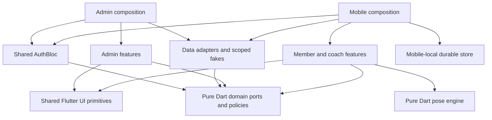
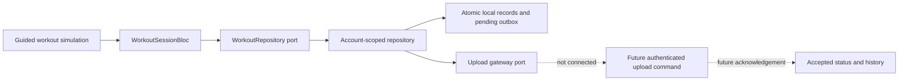

# GainPath architecture implementation report

Date: 2026-09-19
Scope: complete structural migration of the existing prototype; backend-ready foundations, not a production-complete fitness platform.

## Outcome

GainPath now has two separate applications in one workspace: `apps/mobile` for members/coaches and `apps/admin_web` for administrators/staff. Shared code is packaged, not imported from another application's source. The old root application and runners have been migrated out of the root. This is an appropriate architecture for the current team/product size: a modular monorepo and one modular backend, without the operating cost of independent microservices.

The foundations are stronger than a folder-only scaffold: dependency checks, scoped fake data, cancellable authentication, account-owned durable storage, transactional backend services, contract tests and emulator tests enforce important boundaries. They do not establish that every existing screen has production-quality business logic. Most feature repositories remain prototype implementations; replacing their synchronous APIs is part of the following backend work.

## Implemented structure

```text
gainpath/
├── pubspec.yaml + pubspec.lock          Workspace and shared resolution
├── apps/
│   ├── mobile/
│   │   ├── android/ + windows/          Native runners
│   │   ├── lib/main.dart               Thin entry point
│   │   ├── lib/app/                    App composition, guarded routing, shells
│   │   ├── lib/navigation/             Navigation names and argument contracts
│   │   ├── lib/features/               Member/coach presentation and BLoCs
│   │   │   └── workout/                Domain ports, repository, BLoCs, screens
│   │   ├── lib/infrastructure/local/   Native account-scoped outbox
│   │   └── test/
│   └── admin_web/
│       ├── web/                        Web runner, icons and manifest
│       ├── lib/main.dart
│       ├── lib/app/                    Independent DI, auth gate and admin shell
│       ├── lib/navigation/             App-local visual navigation primitives
│       ├── lib/features/               Administrative workflows
│       └── test/
├── packages/
│   ├── gainpath_domain/                Pure Dart entities, policies, ports
│   ├── gainpath_data/                  Pure Dart adapters and scoped fakes
│   ├── gainpath_identity/              AuthBloc and role-entry policy
│   ├── gainpath_ui/                    Flutter tokens and shared primitives
│   └── gainpath_pose/                  Detector port and portable pose engine
├── functions/
│   ├── src/modules/coaching/           Booking callable and service
│   ├── src/modules/commerce/           Verified payment ingress boundary
│   ├── src/modules/workouts/           Upload contract foundation
│   ├── src/platform/                  Validation, authorization, transaction port
│   ├── test/                          Service and schema tests
│   └── emulator/                      Real Firestore Rules/transaction tests
├── contracts/                         Versioned command schemas
├── firebase/                          Rules, indexes, emulator configuration
├── tool/                              Boundary checker and verify.ps1
└── .github/workflows/verify.yml        CI without deployment
```

Feature directories reflect business capabilities rather than creating 13 unrelated packages. Existing M1/M8/M11 identity screens share identity contracts; M7/M9/M10 use coaching; M5/M9.3/M12 use analytics. Workout, membership, gamification, chatbot, recommendation and content retain their own capability boundaries. Domain and data provide public per-feature barrels; application BLoCs and role screens reside only in their owning application.

## Dependency and runtime diagrams



The data package in that diagram is shared source, not one global database or shared memory. Each application and signed-in session receives separate repository instances.



The current default upload gateway reports unavailability; a record stays pending. No real payment, AI recommendation, camera capture or server acceptance is implied by the prototype UI.

## What changed and why

1. **Application isolation.** Migrated the original feature files and tests to app/package owners. Moved Android and Windows runners under mobile, and web assets under admin. Firebase Hosting targets the admin build only. Mobile cannot construct an admin shell.
2. **Dependency inversion.** Domain no longer imports Flutter's `TimeOfDay` or `IconData`; portable values are converted in presentation. Auth repository contracts live in domain. AuthBloc depends on contracts, not concrete data implementations. Feature screens no longer import other features' screens or the app composition root; app routing constructs destinations.
3. **Session ownership.** Replaced static mutable fake seeds with `MockDataSession` instances. Both app roots recreate repositories/feature state when the authenticated session changes. Authentication supports restoration, rejects stale results after logout and requires a valid user/organization session for route entry. Restoration displays loading before mounting login UI.
4. **Durable workout boundary.** Native application-support storage uses account-specific paths, serialized read/modify/write operations and atomic replacement. Repository checks reject cross-account records and stale upload results. Saved records survive native app restarts. The guided route injects its repository and simulated detector; presentation does not choose its own concrete storage. The original animated workout remains available as an explicitly labeled demo preview.
5. **Backend ownership.** Booking services validate membership and branch scope, availability, timezone-based daily limits and overlapping slots. Transactions replace expired holds, serialize daily accounting and deduplicate identical request IDs while rejecting conflicting payloads. Payment ingress persists a verified event only once at a valid Firestore document path. The public handler fails closed until a real provider verifier is supplied.
6. **Enforcement.** The checker parses import/export directives including conditional alternatives, normalizes paths, checks external `src` access, checks transitive dependencies, rejects root runtime resurrection and rejects feature implementation/composition coupling. CI covers both apps, shared packages and backend; lockfiles pin resolution.

## Verification evidence

Executed locally using Flutter 3.38.9 / Dart 3.10.8. Backend tests used the installed bundled Node runtime and an isolated `demo-gainpath` Firestore emulator. No production project was deployed or modified.

| Check | Observed result |
| --- | --- |
| Domain package | 26 tests passed |
| Data package | 70 tests passed |
| Pose package | 9 tests passed |
| Identity package | 12 tests passed |
| Shared UI package | 1 test passed |
| Mobile app | 59 tests passed |
| Admin app | 2 tests passed |
| Architecture checker regression suite | 16 tests passed |
| Architecture boundary check | Passed |
| Dart analyzer across apps, packages, tools and tests | No issues found |
| TypeScript source and test compilation | Passed |
| Backend service/schema tests | 43 tests passed |
| Firestore emulator Rules/transaction tests | 11 tests passed |
| Admin web debug build | Built successfully |
| Android debug APK | Built successfully |

Tests cover fake-repository isolation, stale auth cancellation, local save/sync concurrency, account ownership, missing/invalid roles, registration/verification/profile transitions, transaction races and server-owned client write denial. A read-only review caught inaccessible authentication flows and a dead-end verification notice; the entry points and account-state transition were restored with a regression test. Builds verify compilation, not physical-device behavior. The CI definition is added but its remote execution is not claimed. Windows compilation, real Firebase adapters, real camera/pose performance, release signing, Storage Rules emulator coverage and a production security review remain unverified.

## Architectural limitations and next process

Do not begin with another wholesale folder migration. Keep the current boundaries and deliver backend integrations in vertical slices:

1. **Identity and environment bootstrap.** Create separate development/staging/production Firebase projects and registrations. Add app-local FlutterFire SDK gateways, membership provisioning and session refresh. Preserve actual staff capabilities/branch assignments in the client authorization model; current `AppRole.admin` is an app-entry classification, not permission to perform every administrator operation. Server-side membership remains authoritative.
2. **One production workout flow.** Define versioned summary validation/acceptance, connect authenticated upload with server deduplication, then implement native camera/detector lifecycle and one measured exercise. Keep raw camera frames local unless a separately approved requirement says otherwise. Add physical-device, restart, logout-during-upload and offline-recovery tests.
3. **Booking and commerce.** Connect asynchronous availability/booking adapters. Review provider-specific checkout and signatures, add payment reconciliation/refund state machines and server-owned price calculation. The current client checkout and double-valued prices are demo behavior; use the shared minor-unit money contract for production commands.
4. **Remaining capabilities.** Add authoritative reward ledgers, content commands, coach operations, analytics projections, assistant and recommendation services capability by capability. Move decision logic from prototype screen callbacks into tested application/domain operations as each feature becomes real. Replace synchronous mutable list ports with explicit asynchronous command/query contracts instead of forcing Firebase into synchronous APIs.
5. **Operational release gates.** Add App Check, least-privilege deployment identities, telemetry, rate limits, backups, retention/deletion policies, Storage Rules tests and provider/device acceptance tests. Enable releases only with configured real adapters; current production/release mock guard intentionally blocks demo mode.

The modern command contracts and legacy prototype contracts intentionally coexist during this next phase. Import per-feature barrels or explicitly qualify duplicate concepts such as booking repositories. Consolidate each legacy contract when its real implementation is ready; do not expose fake data as a production fallback.

## Git and documentation

The migration is recorded on `codex/architecture-completion`; no history was rewritten and no deployment was performed. Git detects many file moves because their contents were preserved. `tool/architecture_migration_manifest.json` records the original 213-file mapping. Removed compatibility wrappers and one-off migration scripts no longer participate in runtime or verification. Migrated implementations reside in their new application and package locations.

The earlier thesis chapters and sequence diagrams remain requirements references, not executable instructions. Update them after each accepted production vertical slice. This report supersedes claims that the root app is still a compatibility host; the target blueprint continues to describe future integrations as well as the implemented structure.
